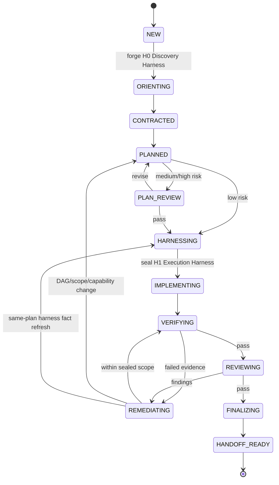

# PI Loop Engineering v0.3 设计

## 1. 摘要

v0.3 将原 Superworkflows 重命名为 **PI Loop Engineering**（PI = Physical AI），并从“一个路由器加六个同级阶段命令”重构为“四个公开命令加内部闭环运行时”。品牌主张是 **From Prompt Engineering to Loop Engineering for Physical AI**：Prompt 仍是 Loop 内的组件，但工程对象从单次提示升级为包含目标、上下文、工具、状态、并行派发、验证、审查、停止条件、Handoff 和演进的受控系统。

- `$loop-engineering`：从任务契约到独立审查、验证和 Handoff 的完整工程闭环；
- `$status`：只读检查 Loop、证据、Finding、Handoff、Release 和下一步；
- `$release`：消费不可变 Handoff，评估或执行明确授权的提交、PR、版本和部署动作；
- `$knowledge-evolution`：从已完成 Loop/Release 中形成受审查、待批准的知识或工作流改进提案。

删除 `$init`、`$run`、`$review` 和 `$learn`，不提供别名，不迁移旧持久状态。Review 保留为 Loop Engineering 和自然语言只读审查请求使用的内部能力。CodeGraph 从前置依赖降为条件式结构检索加速器；没有 MCP、CLI 或索引时，模型使用原生 Explore、搜索、源码读取和 Git 工具继续工作。

v0.3 同时把控制面从 Python Clean Break 迁移为 **TypeScript Source + committed JavaScript ESM Runtime**。`src/` 是唯一人工维护的控制面源码，`dist/` 是可直接由 Node.js 执行、提交到 Git 且可确定性复算的普通 ESM 产物。生产运行只依赖 Node.js `>=22` 和内置模块；不保留 Python 控制器、Python 测试或双运行时入口。Shell 若存在，只能作为调用 `node dist/*.js` 的可选 POSIX 包装器，不能拥有状态、锁、授权或 Release 逻辑。

该设计参考 MiMo-Code 的 [Compose Next](https://github.com/XiaomiMiMo/MiMo-Code/blob/main/packages/opencode/src/skill/builtin/.bundle/compose-next/SKILL.md) 和 [Compose 工作流](https://github.com/XiaomiMiMo/MiMo-Code/blob/main/packages/opencode/src/workflow/builtin/compose.js)：交互路径采用一个紧凑闭环并在 Finish/Handoff 停止；确定性无人值守路径才可以在独立授权下继续合并或发布。它同时吸收 [harness-foundry](https://github.com/cobusgreyling/loop-engineering) 的版本化 Runtime Stack、Session 与 Trace 思想，但在插件内部实现，不把外部包或新的初始化命令设为依赖。PI Loop Engineering 保留自动驾驶、机器人和具身智能所需的证据、回滚、环境晋级与硬件授权边界，不照搬通用软件假设。

## 2. 问题

v0.2.5 的能力总体完整，但用户界面和机器生命周期存在五类结构问题：

1. `$init` 把 CodeGraph 初始化和 `.ai` 持久状态创建绑定在一起。仓库没有 CodeGraph 时仍给人“必须先初始化”的印象，而模型原生工具已经能够完成探索。
2. `$run` 实际执行 `assets/loop-engineering/workflow.md` 的完整工程闭环，名称没有表达真实方法论。
3. `$review` 与 `$run` 内部的计划审查、代码审查和安全审查重复出现在主流程表面。
4. `$run` 同时包含集成、Release readiness 和 Learning；`$release` 又重复集成与就绪检查；`$learn` 则被机器状态视为完成前必经阶段，导致工程、发布和知识演进边界不清。
5. Sub-agent 的角色、Worktree、预算和停止规则主要由提示级契约表达；并行派发没有原子绑定任务保留、Actor、输入 Digest、写集合、Attempt 和 Result，运行边界也没有汇聚为可验证的每 Loop Harness。

此外，当前 Windows 基线无法运行主要控制面：`loopctl.py` 和 `sync_agents.py` 无条件依赖 POSIX `fcntl`，子进程文本按系统 GBK 解码，符号链接测试假定具有 Windows 特权，插件版本测试仍断言 `0.2.0`。v0.3 必须同时修复这些质量问题，否则命令重命名不会产生可靠的跨平台插件。

## 3. 目标与非目标

### 3.1 目标

- 让普通用户只理解工程、状态、发布和知识演进四个稳定意图。
- 让精确 `$loop-engineering` 调用自动建立可恢复 Loop，无需预初始化。
- 让内部 Review 成为风险自适应门禁，而非用户必须编排的同级阶段。
- 以一个不可变、可验证的 Handoff 明确分隔工程与发布。
- 让 Knowledge Evolution 可选、后置、提案驱动，禁止活动 Loop 自修改。
- 在 CodeGraph 不存在或不可用时安全降级。
- 在 Windows、Linux 和 macOS 上提供一致的控制面与测试结果。
- 以 TypeScript 严格类型约束 Loop/Harness/Envelope 状态，并让提交的 JavaScript 运行产物与已审查源码可机械证明一致。
- 保留独立审查、证据新鲜度、回滚和外部/硬件动作授权等安全属性。
- 在任何工程源码写执行前铸造并冻结每 Loop Runtime Harness，使范围、能力、预算、证据、停止和环境晋级规则可验证。
- 通过 Runtime Gate 约束控制器介导的工具与状态转移、检测主 Agent 越界写，并由 Dispatch Broker 对 DAG 依赖、并发 Wave、读写集合、Worktree、Attempt 和结构化 AgentResult 进行原子准入与回收。

### 3.2 非目标

- 不兼容旧命令或 workflow-spec v1 状态。
- 不自动初始化 CodeGraph。
- 不把本地哈希链描述为密码学身份认证。
- 不让 Knowledge Evolution 自动修改生产 Skill、Agent、安全门禁或活动 Loop。
- 不让 `$loop-engineering` 隐式授权 Push、PR、Tag、Publish、Deploy、HIL 或真机动作。
- 不引入通用个人记忆、递归委派、定时任务或无限自主循环。
- 不把 Harness 描述为操作系统沙箱、密码学 Agent 身份或宿主工具权限的替代品。
- 不为了并行而并行；存在共享写集合、顺序依赖、集成风险或 Physical AI 物理设备/环境动作时保持串行。
- 不保留 Python Runtime，不让 Shell 承担控制面核心，也不要求用户在运行已发布插件前执行 `npm install` 或本地编译。

## 4. 用户界面

| 命令 | 输入 | 默认行为 | 可产生的副作用 | 结果 |
|---|---|---|---|---|
| `$loop-engineering <task>` | 任务描述 | 新建持久 Loop 并执行闭环 | 仓库源码、测试、本地分支/Worktree、Loop 状态 | Final 或阶段性 Handoff |
| `$loop-engineering resume <loop-id>` | 精确 Loop ID | 校验 Lineage、仓库、工作区和事件后恢复 | 继续指定 Loop | 更新检查点或 Handoff |
| `$status [loop-id]` | 可选精确 Loop ID | 未指定时列出候选；指定时深入检查 | 无 | 阶段、Harness digest/drift、Dispatch/lease、预算、证据、Finding、阻塞和下一动作 |
| `$release <loop-id> [action]` | Loop/Handoff 与可选动作 | 未指定动作时仅做 Readiness Check | 仅执行明确授权动作 | Release 记录、URL、版本或阻塞原因 |
| `$knowledge-evolution [loop-id…]` | 一个或多个完成 Loop/Release | 提炼和审查候选改进 | 仅写 Proposal | Project knowledge、Policy 或 Workflow 提案 |

`$loop-engineering` 与 `$knowledge-evolution` 接受可选 `--markdown-language en-US|zh-CN`，只控制 `.ai-loop/` 中 Markdown 的生成语言。用户在同一次请求中明确说“Markdown 用中文”与 `--markdown-language zh-CN` 等价。`$status` 与 `$release` 的对话显示可以跟随当前请求语言，但不会把中文写入 JSON/JSONL 或其他非 Markdown Artifact。

旧的 `$init/$run/$review/$learn` Skill、别名和 Tombstone 全部删除；宿主按普通未知命令处理。迁移提示只存在于 README/Changelog，不为了自定义错误而保留兼容执行面。

`skills/` 下只存在四个公开 Skill。隐式选择由各 Skill 的描述和共享的非 Skill `assets/router/trigger-policy.json` 完成；四个 Skill 在任何副作用前调用同一分类器，因此不存在可显式调用的第五个 Router Skill：

- 复杂实现请求 → Session-only Loop Engineering，除非用户精确调用 `$loop-engineering`；
- 状态请求 → `$status` 的只读能力；
- Release 请求 → Readiness-only，直到精确 `$release` 和动作授权成立；
- 知识提炼请求 → Response-only，直到精确 `$knowledge-evolution`；
- 单独审查请求 → 隐式进入 `$loop-engineering` 的 Session-only/read-only 模式，加载 `assets/loop-engineering/review.md` 与只读 Reviewer Agent，不暴露 `$review` Skill 或命令。

## 5. Loop Engineering 生命周期



为避免图形噪声，图中不重复绘制每个非终态 phase 到 `CANCELLED` 的边；workflow-spec v2 必须逐一枚举这些合法取消边，`CANCELLED` 无出边。`PAUSED/BLOCKED/DEGRADED` 是保留当前 phase 的 status overlay，`NON_CONVERGENT` 是保留 Checkpoint 的终止 status，不作为另一个可继续执行的 phase。

机器状态为：

`NEW`、`ORIENTING`、`CONTRACTED`、`PLANNED`、`PLAN_REVIEW`、`HARNESSING`、`IMPLEMENTING`、`VERIFYING`、`REVIEWING`、`REMEDIATING`、`FINALIZING`、`HANDOFF_READY`、`CANCELLED`。

Loop status 与阶段分离：`ACTIVE`、`DEGRADED`、`PAUSED`、`BLOCKED`、`NON_CONVERGENT`、`COMPLETE`、`CANCELLED`。`HANDOFF_READY + COMPLETE` 只表示工程 Handoff 完成，不表示代码已发布。

任何活动阶段都可以在不丢失 phase 的情况下因用户决定、资源或授权进入 `PAUSED`，因安全、仓库规则、证据或可解除环境问题进入 `BLOCKED`；解除条件经精确 Loop ID 验证后恢复 `ACTIVE` 并回到原 phase。可选能力降级使用 `DEGRADED`，但不放宽门禁。预算耗尽或行为振荡进入终止性 `NON_CONVERGENT`，只能从 Checkpoint 创建 Child Loop；取消同时把 phase/status 设为 `CANCELLED`。`HANDOFF_READY + COMPLETE` 是封闭终态，不能恢复并覆写 Handoff。状态机删除 v1 的 `INTEGRATING`、`AWAITING_EXTERNAL_APPROVAL`、`DELIVERING` 和 `LEARNING`，这些职责分别进入 Release 或 Knowledge Evolution 生命周期。

`ORIENTING` 前的自动 Bootstrap 原子写入只读 `H0 Discovery Harness`；它约束仓库根、可读范围、可用检索能力、网络和禁止动作。计划及其风险 Review 通过后进入 `HARNESSING`，生成不可变 `H1 Execution Harness` revision。没有有效 H1，主 Agent 与 Sub-agent 均不得修改工程源码或制品；不得静默扩大现有 Harness。

任一 H1 活动 phase 发现 `HARNESS_DRIFT` 时先停止新执行：若改变 Plan、DAG、范围、能力、风险或授权，返回 `PLANNED` 并重新风险分类及 Plan Review；只有不改变计划/授权的事实或输入刷新才能进入 `HARNESSING` 生成同范围 revision。

## 6. 风险自适应 Review

| 风险等级 | 判定示例 | 必须执行的独立门禁 |
|---|---|---|
| Low | 局部、低影响、无安全接口变化 | 验证后的最终 Diff Review |
| Medium | 跨模块、接口、持久化、并发或回滚相关 | Plan Review + 最终 Diff Review |
| High | 控制、安全、执行器、实时、HIL、真机、模型发布 | Plan Review + Code Review + Safety/Environment Evidence Review |

所有等级必须经过需求契约、实现、实际验证、独立 Review、Finalize 和 Handoff。低风险可以合并文档或实现活动，但不能删除最终独立 Review。Reviewer 为源码只读角色，接收规范与验收条件、Base/Head SHA、Diff 坐标和精简验证摘要；不接收实现者的结论性叙述。Reviewer 在独立只读 Source snapshot 上工作；测试、分析器等可能写入的 Cache、Temp、Coverage 和输出被重定向到 Reviewer 私有目录。无法隔离或会改写源码/共享资源的命令必须声明副作用，在专用 Worktree 中取得对应资源 lease 后执行，不能再称为无 lease 的只读操作。Verify 完全结束后才启动 Review。Implementer 可以标记 Finding 为 `FIXED`，只有独立 Reviewer 可以在当前 Commit 与证据上标记 `VERIFIED`。

## 7. 持久化与文档

精确 `$loop-engineering` 是创建持久 Loop 的授权边界。它在首次状态写入前自动 Bootstrap；不需要 `$init`。隐式路由保持 Session-only，不创建 `.ai-loop/`。用户明确要求不持久化时，Loop 只在会话中运行并在回复里给出非持久 Handoff，且不得宣称可恢复。

```text
.ai-loop/
├── project-policy.json
├── preferences.json
├── loop/<loop-id>/
│   ├── LOOP.json
│   ├── events.jsonl
│   ├── LOOP.md
│   ├── harness/
│   │   ├── h0-discovery.json
│   │   ├── h1-execution-r001.json
│   │   ├── wave-inputs/<wave-id>.json
│   │   └── attempts/<work-item-id>/<attempt>/{request,result,bundle}.json
│   ├── evidence/
│   ├── checkpoints/<sequence>.json
│   └── handoff.json
├── releases/<release-id>/
│   ├── release.json
│   ├── release-harness.json
│   ├── actions/<operation-id>.json
│   ├── events.jsonl
│   └── evidence/
└── knowledge/proposals/<proposal-id>.md
```

Git 仓库另有不随 Worktree 复制的共享协调根：

```text
<canonical-git-common-dir>/pi-loop-engineering/coordination/
├── repository.json
└── events.jsonl
```

`.ai-loop/project-policy.json` 是可选、用户维护的仓库命令与门禁覆盖层，不存在时不得阻塞 Loop。插件不自动生成它；每个 Loop 从仓库事实发现测试、构建、回放和安全门禁并记录在 `LOOP.json`。重复且稳定的发现可由 Knowledge Evolution 提出 Policy 更新。

### 7.1 Markdown Language 契约

`.ai-loop/` 是可被工具读取的持久工程记录。只有 Markdown 支持本地化；JSON、JSONL、Schema、事件、Harness、Envelope、Evidence metadata 和其他非 Markdown Artifact 的插件生成内容固定为英文。Markdown Language 不从操作系统 Locale、仓库语言或当前对话语言自动推断。v0.3 保证 `en-US` 与 `zh-CN`，默认固定为 `en-US`。新 Loop 或 Knowledge Proposal 的选择优先级为：

1. 当前精确命令的 `--markdown-language` 或同一次请求中的明确 Markdown 语言指令；
2. 可选 `.ai-loop/preferences.json` 的 `markdown_language`；
3. `en-US`。

`.ai-loop/preferences.json` 是英文-only、用户维护的表现层偏好，不属于工程 Policy，不自动创建，也不参与 H1、Handoff 或 Release freshness digest。实际选择的 locale code 写入 `LOOP.json` 的 `markdown_language`、Proposal front matter 和 Handoff；这些非 Markdown 字段仍是英文 key 加 BCP 47 code，不包含中文叙述。未支持的值在首次持久写入前返回 `INVALID_MARKDOWN_LANGUAGE`。活动 Loop 可以显式切换语言：控制面追加英文 `MARKDOWN_LANGUAGE_CHANGED` 事件，并从结构化事实重新生成仍可变的 `LOOP.md`；已存在的原始输入和 Evidence 不翻译。`HANDOFF_READY + COMPLETE` 后不得为改语言而重写 Loop 或 Handoff，只能按请求语言生成非持久只读显示，或让新的 Markdown Proposal 选择自己的 Markdown Language。

语言边界如下：

- `LOOP.md` 与 Knowledge Proposal `.md` 正文使用所选语言；稳定段落 ID（如 `[S1]`）、Evidence 引用和 Finding ID 不翻译；
- `LOOP.json`、Checkpoint、Handoff、Release、JSON/JSONL、Schema、Harness、Envelope 与 Evidence metadata 的 key、枚举和插件生成字符串只使用英文，ID、Digest、事件类型、命令参数和路径保持英文/ASCII 稳定契约；
- 用户原始输入、源码符号、引用文本以及 stdout/stderr、编译器、测试、仿真器和设备日志作为 opaque/verbatim Evidence 保留原文，不计为插件对非 Markdown 中文的语言支持；需要解释时只在 Markdown 或非持久对话中另附摘要；
- 对话回复通常跟随用户当前语言，但不会隐式改变 `.ai-loop/` 的 Markdown Language。`$status` 的“用中文显示”只本地化本次非持久只读结果。

v0.2.5 的十一个编号叙述文档合并为一个 `LOOP.md`：

- `[S1] Problem and Contract`
- `[S2] Design and Safety Invariants`
- `[S3] Out of Scope`
- `Tasks`
- `Report`
- `Verification`
- `Review and Residual Risk`
- `Journey Log`（最多五条可迁移经验）

每个 Git common-dir 解析到唯一 canonical coordination root；所有 Worktree 和 Loop 共用其中的仓库级 branch/path/integration lease 与事件序列，不能各自在 Worktree 的 `.ai-loop/` 中建立互不相见的协调状态。非 Git 工作区使用解析后的 canonical workspace root 下 `.ai-loop/coordination/` 作为协调根。

`LOOP.json` 保存英文-only 机器状态、任务摘要、Finding、证据索引、当前 Harness revision/digest、`markdown_language` 和 Handoff 指针；`events.jsonl` 保持英文-only 的追加式哈希链，并记录 Dispatch reservation、lease、result acceptance 和 integration；`harness/` 保存英文-only 的不可变 Harness、Wave Input 与 Agent request/result/bundle。每条 Evidence 强制绑定 Loop、Work Item、Attempt、Actor role、H1 digest、WaveInput、Output Tree、argv、cwd、开始/结束时间、退出码、脱敏环境指纹、工具/仿真器版本、stdout/stderr digest 和制品 digest；缺少绑定或输入不一致的旧 Evidence 不得跨 Attempt/Wave 复用。哈希链用于发现偶发或局部篡改，不是抵抗同一用户替换全部本地状态的签名系统。

`events.jsonl` 的已提交事务是控制面事实源，`LOOP.json` 是可重建快照。涉及多文件的 Harness、Evidence、Agent bundle、Checkpoint 和 Handoff 更新使用短事务：先追加带 expected sequence/digest 的 `*_INTENT`，把制品写入临时文件并 `fsync`，校验后原子 rename，再追加 `*_COMMIT`，最后原子替换 `LOOP.json`。只有存在有效 Commit event 的制品可被状态机消费；恢复时回放日志，完成可证明幂等的事务或隔离未提交制品。Finalize 使用 `handoff.pending.<transaction-id>.json`，因此崩溃不会产生既像 Final Handoff 又没有 ledger pointer 的半完成状态。

## 8. Handoff 契约

暂停或阻塞写入递增的 `checkpoints/<sequence>.json`，记录已完成成果、证据、阻塞原因和准确恢复入口。只有 `FINALIZING` 成功后写入一次 `handoff.json`；写入后不可修改。

Final Handoff 必须包含：

- Schema、Markdown Language、Loop、仓库、分支、Worktree、Base/Source Head SHA、Reviewed Git Tree Digest 和 Workspace Digest；
- H0/H1 Harness schema、revision、规范化 digest、实际 Dispatch/Attempt 摘要和任何 Harness Drift 记录；
- 需求契约、范围、验收条件、Out-of-scope 和安全不变量；
- 最终 Diff 摘要与每个任务的结果；
- 验证命令、环境、退出码、`PASS/FAIL/NOT_RUN` 与证据哈希；
- Reviewer 身份记录、Verdict、Finding 状态和剩余风险；
- 回滚目标、程序、触发条件、恢复时间估计和最高已授权环境证据；
- 未验证的 Replay/Simulation/HIL/Robot 门禁；
- 推荐 Release 动作及禁止自动执行的动作。

Handoff 计算规范化 SHA-256，并包含显式 digest manifest：Markdown Language、Reviewed Source/Tree/Workspace manifest、Project Policy、最终 `LOOP.md`、H0/H1、已封存 Agent bundle、Loop-bound Evidence 列表和 Finalize commit event sequence。Source、Tree 与 Workspace 三类 manifest 使用同一 inclusion/exclusion schema，全部排除整个 `.git/`、`.ai-loop/`、`.codegraph/` 控制/索引面和声明的临时 Cache；这些排除项不能包含产品源码或 Release 制品。被排除的 Project Policy 与本 Loop 制品通过上述独立条目显式绑定；表现层 `preferences.json`、Release/coordination 状态不绑定。Release 记录 Handoff digest，并在任何动作前重新计算 Reviewed Source/Tree/Workspace 与固定的 Loop Evidence manifest。源码、绑定配置/制品、Project Policy、H1 或 Loop-bound Evidence 变化产生 `STALE_HANDOFF`；Release 自己的 record、Action Envelope 和 Evidence 独立追加并链式绑定 Handoff，不参与原 Handoff 的 freshness digest，因而不会自我使其失效。

Final Handoff 每 Loop 只存在一个。`HANDOFF_READY + COMPLETE` 后若 Handoff 陈旧，Release 不修改实现，也不能恢复并覆写该 Loop；它必须创建引用原 Loop/Handoff 的 Child Loop，在重新 Contract/Verify/Review/Finalize 后生成新的 Handoff。

`commit` 是唯一允许改变 Commit SHA 而不使 Handoff 失效的封装动作：它只能把 Handoff 已绑定的未提交工作树写成 Commit，不得编辑文件；提交后的 Git Tree 必须与 `reviewed_tree_digest` 完全一致。Release record 保存 `source_head_sha`、新 `release_commit_sha` 和相同 Tree digest。已有相同 Reviewed Tree 的干净 Commit 时，`commit` 为幂等 No-op。Push、PR 和 Tag 只能引用这个已验证的 Release Commit。

## 9. CodeGraph 能力降级

CodeGraph 由一个集中式 Capability Resolver 处理，Skill 不再重复硬编码前置步骤：

1. 先读 `AGENTS.md` 等仓库规则。
2. 仓库强制要求 CodeGraph 且无法得到健康索引时返回 `BLOCKED`。
3. 已有健康 `.codegraph/` 时优先 MCP；MCP 不存在但 CLI 可用时使用 CLI。
4. 没有索引、MCP 或 CLI 时使用模型原生 Explore、文件搜索、源码读取和 Git 工具。
5. 插件永不自动初始化缺失索引。用户可在普通工具任务中另行明确要求初始化，但这不是 PI Loop Engineering 生命周期阶段。
6. 精确、可写 Loop 在已有索引上可以执行同步。同步失败时标记 `DEGRADED` 并改用当前 Source/Git；仓库强制 CodeGraph 时改为 `BLOCKED`。
7. Graph 只提供结构导航和影响范围线索。最终源码事实来自当前 Source/Git，行为事实来自实际执行的命令。

## 10. Release 生命周期

`$release` 不属于工程状态机。仅调用 `$release <loop-id>` 在内存中执行只读 Readiness Check，不创建 `.ai-loop/releases/`、不修改仓库，也不产生外部动作。只有用户给出明确 action 后才创建引用 Final Handoff digest 的独立 Release record：

`NEW → VALIDATING_HANDOFF → READY → AWAITING_AUTHORIZATION → EXECUTING → RECONCILING → RELEASED`

失败可进入 `BLOCKED`；用户可以 `CANCELLED`。

动作包括 `commit`、`push`、`pr`、`tag`、`publish`、`deploy-sim`、`run-hil`、`deploy-robot` 和 `run-real-robot`。每个可变动作必须明确绑定 Action、Target、Handoff digest、授权者和有效期。`commit` Action Envelope 在目标 Commit 尚不存在时绑定 `source_head_sha`、`reviewed_tree_digest`、`expected_parent_sha`、目标 Branch 与 Commit metadata digest；成功后验证 Tree 不变并产生 `release_commit_sha`。`push/pr/tag/publish/deploy-*` 等后续动作必须绑定该已验证 Release Commit。硬件动作在执行前再次请求即时确认。执行前记录幂等 Operation Intent；响应丢失时先 Reconcile 外部状态，禁止盲目重试 `PENDING` 或 `UNKNOWN` 操作。

Release 不继承 H1 Execution Harness 的写权限。Readiness Check 使用临时只读 Release Harness；每个可变动作生成不可变 Action Envelope，绑定 Handoff、Reviewed Tree、Action、Target、可用工具、授权和有效期。一个 Action Envelope 不能被复用于另一目标或另一 Physical AI 环境节点。Release Evidence 写入自身英文-only record，绑定 Action Envelope、输入/输出状态和原 Handoff digest；失败若要求修改源码，只能创建新的 Child Loop。

## 11. Knowledge Evolution

`$knowledge-evolution` 只读取 `HANDOFF_READY` Loop 和已结束 Release，不读取活动 Loop 作为可推广结论。候选分三类：

1. Project Knowledge：稳定的架构事实、决策与约束；
2. Project Policy：可复用的命令、门禁、证据和回滚规则；
3. Workflow/Skill/Harness：重复的人工流程、Reviewer 模式、模板、Agent、Harness Policy 或 Dispatch 改进。

候选必须包含来源 Loop/Handoff 哈希、观察次数、用户纠正来源、反例、隐私检查、预期收益、安全影响、离线评估、Canary、Rollback 和复审日期。多 Loop 重复观察可以进入 Review；单 Loop 候选标记 `PROVISIONAL`，但明确用户纠正可以作为一个高权重来源。Proposal 状态为 `PROVISIONAL`、`REVIEW_PENDING`、`REVISE`、`APPROVED`、`REJECTED`、`SUPERSEDED` 或 `APPLIED`。

Knowledge Evolution 不直接应用 Proposal。明确批准后创建新的 `$loop-engineering` Loop 修改目标知识、Policy、Skill、Agent 或模板，并执行对应回归、Review 和 Handoff。原 Proposal 仅在该实施 Loop 完成后标记 `APPLIED`。

## 12. 错误与收敛语义

| 结果 | 含义 | 行为 |
|---|---|---|
| `DEGRADED` | 可选能力不可用，但有安全替代路径 | 记录限制并继续 |
| `PAUSED` | 等待用户决定、资源或授权 | 写 Checkpoint，可精确恢复 |
| `BLOCKED` | 安全、规则、证据或环境前置条件不满足 | 停止受影响路径，列出解除条件 |
| `NON_CONVERGENT` | 修复/Review 循环重复或引入新 Critical | 写阶段性 Handoff，不强行通过 |
| `STALE_HANDOFF` | Handoff 与当前工程事实不一致 | Release 拒绝，返回 Loop |
| `HARNESS_DRIFT` | 当前事实、任务、能力或权限不再匹配已封存 Harness | 停止新派发；同范围修订 Harness，实质扩权则创建 Child Loop |
| `DISPATCH_REJECTED` | 依赖、写集合、Worktree、预算、Actor 或输入 Digest 不满足准入 | 不启动 Agent，记录可操作原因 |
| `STALE_AGENT_RESULT` | AgentResult 的 wave base 或读依赖已被先集成结果改变 | 隔离结果，不自动合并；在新输入上重新验证或重新派发 |
| `INVALID_MARKDOWN_LANGUAGE` | 请求的 `.ai-loop/` Markdown Language 不受支持 | 任何持久写入前拒绝并列出 `en-US`、`zh-CN` |
| `COMPLETE` | Final Handoff 已生成 | 不暗示已发布 |

Loop 对 Agent attempts、Review/fix cycles、状态跳转和证据命令时间设预算。达到预算不转化为成功。非收敛条件同时考虑次数和行为：同一区域重复 Finding、修复引入新 Critical、验证结果振荡或证据持续无法复现。状态变化、Finding、Evidence、授权和外部 Intent 都在工具结果边界后立刻 Checkpoint。

## 13. Runtime Harness 与并行派发

PI Loop Engineering 把 Harness Foundry 作为 `$loop-engineering` 的内部运行时阶段，不新增 `$harness` 或 `$init`。三个不变量是：

1. **No Harness, No Execution**：没有与当前 Loop 事实匹配的 H1，不允许主 Agent 写源码，也不启动写 Sub-agent；
2. **No Evidence, No Transition**：没有门禁要求的当前证据，不推进生命周期；
3. **No Fresh Approval, No Physical Action**：没有动作、目标、环境和有效期绑定的即时授权，不执行 HIL、车辆或机器人动作。

### 13.1 双阶段 Harness

精确 `$loop-engineering` 持久 Loop 使用两个不可变阶段：

- `H0 Discovery Harness`：在自动 Bootstrap 时根据系统/开发者/用户权限、仓库根和已读取的顶层仓库规则生成。默认只读，限定 Explore、CodeGraph/原生搜索、Source/Git 读取、网络和禁止动作；
- `H1 Execution Harness`：在最终 Plan/DAG 及所需 Plan Review 通过后生成，绑定允许的写集合、Worktree、Agent、工具、验证、预算、停止条件和 Physical AI 环境节点集合。

隐式 Session-only 路由使用同构的临时 Harness，但不写 `.ai-loop/`、不可恢复、不得执行外部或硬件动作。由于没有持久 reservation/lease/recovery，它只允许主 Agent 单写者实现和并行只读 Agent，不允许并行写 Sub-agent。任何 Harness revision 均规范化计算 SHA-256 并写入事件链；旧 revision 保留只读。范围、能力、DAG、验证门禁、允许的环境节点或预算变化必须生成新 revision；权限扩大或安全假设实质变化创建 Child Loop，不得用 revision 掩盖新的授权边界。

H1 绑定初始输入和 WaveInput 的生成/准入策略，不预先绑定后续 Wave 的未知 digest。每个 Wave 集成前按该策略封存独立 `WaveInput`，其 digest 由 request/result/WAL event 绑定；只要 Plan、权限、策略和 DAG 不变，产生新 WaveInput 不要求重铸 H1。H1 至少包含：

| 域 | 必须绑定的内容 |
|---|---|
| Identity | Loop、canonical Git common-dir/workspace、Initial Input SHA/Tree/Workspace、WaveInput policy 与 Project Policy digest |
| Scope | Objective、Acceptance、Out-of-scope、Allowed/Denied paths 与写集合 |
| Artifacts | 行为相关 tracked/untracked/ignored/外部输入、Mode、Digest、Provenance、物化/只读挂载策略、Secret handle 与 Scratch/Cache 排除项 |
| Topology | Task DAG、依赖、Wave 生成规则、声明的读/写集合、集成顺序和 Worktree mapping |
| Actors | 允许的 Agent role/model class、Reviewer 独立性和禁止递归委派 |
| Capabilities | Allowed tools、精确命令、网络、外部系统、硬件禁止项及每项 enforcement class |
| Budgets | 并发数、Attempt、Review/Fix cycle、时间、Token/成本和证据命令上限 |
| Gates | 构建、测试和环境验证节点、`LOOP_REQUIRED/RELEASE_REQUIRED/NOT_APPLICABLE` owner 及证据新鲜度 |
| Stop | Pause、Block、Non-convergence、Circuit Breaker 和人工升级条件 |
| Result | AgentResult、Finding、Evidence、Integration 与 Handoff schema |

### 13.2 Runtime Gate 与 Dispatch Broker

Runtime Gate 是插件控制面动作的统一准入点：它在控制器介导的写工具、Evidence 执行、状态转移、Finalize 和 Handoff 前校验当前 Harness、输入事实、能力、预算和所需门禁。Dispatch Broker 只负责 Runtime Gate 之下的 Sub-agent 生命周期。

Broker 使用 **短事务状态机**，绝不在 Agent 执行期间持有 Loop 或 Repository 锁。所有事务遵循 Repository Coordinator → Loop 的固定锁顺序，通过 WAL Intent/Result、单调 fencing token 和 Compare-And-Swap 防止陈旧 Worker 或恢复进程提交结果：

1. 在没有活动写 Wave 时封存内容寻址 `WaveInput`。Commit/Tree 只是 tracked 基线；H1 必须分类所有影响构建、测试、仿真或运行行为的 tracked、untracked、ignored 与仓库外制品。脏工作区使用临时索引或等价只读快照记录 Source manifest 中的路径、Mode、Blob 和规范化 Tree digest，不改变用户 Index/Worktree；大型模型、标定、数据集或仿真资产可通过只读 mount/URI、版本、digest 和 provenance 绑定而不复制。Secret 只记录 provider/handle/version 等非敏感引用，不捕获明文。无法绑定的行为输入使 Evidence 不可复现并阻止并行或对应门禁。每个 Agent Worktree 必须物化或挂载并验证同一个 WaveInput，而不是只从 HEAD 创建；
2. 在短事务中校验 H1、DAG、WaveInput、Actor、预算和环境节点，跨 Loop 保留 branch/integration/path lease，分配 Attempt 与 fencing token，并写 `DISPATCH_INTENT` 后释放锁；
3. 只有当 `W1 ∩ (R2 ∪ W2) = ∅` 且 `W2 ∩ (R1 ∪ W1) = ∅` 时任务才能进入同一 Wave。普通插件只能校验声明的 read set；仅有宿主级文件访问 Trace 时才能标记 observed read set。读范围未知时记为 `UNKNOWN` 并强制串行；
4. 写入绑定 Harness、WaveInput、声明读集、写 lease、Objective、Acceptance、Allowed Files/Tools、所需证据、停止条件和 fencing token 的 request envelope，然后启动具有新鲜有界上下文的 Sub-agent。Sub-agent 不接收完整父会话、不得递归派发、调用 Router、写 Loop ledger、发布或操作硬件；
5. Agent 结束后，Broker 终止或 fence 该 Attempt，对隔离 Attempt 根目录及 H1 声明的外部可写根执行完整差分，枚举相对 WaveInput 的 tracked、untracked、ignored、rename、symlink、submodule 和外部制品变化，仅排除 H1 中隔离且不影响行为的私有 Scratch/Cache。外部资源默认只读；只有宿主以 Sandbox/mount/Trace `HOST_ENFORCED` 限定可写根且 Repository Coordinator 已取得对应 lease 时才允许 Sub-agent 外部写。缺少该宿主能力时，任何具有外部写能力的并行派发都返回 `DISPATCH_REJECTED`。Broker 校验路径、Mode 和 Blob，拒绝越界写，并封存内容寻址 patch/output-tree/artifact bundle；集成只消费 sealed bundle，不信任 Agent 声明，也不读取之后仍可变化的 Live Worktree；
6. 在短事务中校验 result envelope 的 Loop/Work Item/Attempt/Actor/WaveInput/Harness/fencing token、声明读集、独立观测的实际写集和证据引用，再接受 `AgentResult`；
7. 主 Agent 串行集成。每次集成前取得 Repository integration lease，写 `INTEGRATION_INTENT`，比较当前 Tree 与 WaveInput；若已集成变化触及该结果的声明读集或实际写集，则标记 `STALE_AGENT_RESULT` 并隔离，不自动 Rebase/Merge；成功后记录结果、释放 lease。进程中断时先 Reconcile WAL、fencing token、Agent、lease、Worktree、sealed bundle 和 Integration Intent，禁止盲目重复派发或应用。

H1 同样约束主 Agent 的直接工具调用；主 Agent 不得通过“自己修改”绕过 Allowed Paths、命令、预算或环境门禁，也不得在活动写 Wave 中修改工程源码。所有约束标记为 `HOST_ENFORCED`、`RUNTIME_ENFORCED` 或 `ORCHESTRATION_ONLY`。Runtime Gate/Broker 只能机械拒绝经过插件控制器的工具请求、派发、Result 和状态转移；普通 Codex Plugin 无法拦截宿主允许的所有原始工具调用。主 Agent 路径/工具约束在没有宿主 Hook 时属于 `ORCHESTRATION_ONLY`，每次写边界后的 Tree/Diff 检查负责发现越界；发现后进入 `HARNESS_DRIFT` 或 `BLOCKED`，相关证据失效且禁止 Finalize。硬隔离仍由宿主 Sandbox、文件系统权限、Tool Approval 和外部系统控制承担。不能把提示遵守、同一用户下的本地 Actor 字段、Token 估算或哈希链描述为密码学身份与权限隔离。

### 13.3 并行语义

- 从最终计划生成无环 Task DAG，仅派发依赖已满足的 Ready Set；并发上限由风险、预算与主机能力共同决定，不追求最大并发。
- 只读 Explore 或针对同一 Digest 的专项 Review 可以并行；它们没有写 lease。
- 写任务只有在 `W1 ∩ (R2 ∪ W2) = ∅` 且 `W2 ∩ (R1 ∪ W1) = ∅` 时才可并行，并各自使用独立 Worktree。读集合未知、生成文件、共享 Schema/API、构建配置或未知写范围均视为冲突并串行执行。
- 高风险任务可以把 Code、Safety 和 Simulation/Environment Review 并行派发给不同只读 Reviewer，但 Verdict 汇总与 Finding 状态更新必须串行且由主 Agent完成。
- 集成一次只处理一个已接受的 sealed AgentResult bundle；每次集成后检查 Tree/Digest、剩余结果的读写新鲜度和契约影响，陈旧结果不会自动合并。最终 Verify 针对集成后的单一候选执行，Review 在 Verify 完成后开始。
- 子 Agent 返回结构化 AgentResult；主 Agent 是唯一 Loop ledger writer、集成者和生命周期状态推进者。
- Verify 输出压缩为每条命令的 `PASS/FAIL/PRE_EXISTING/NOT_RUN`、计数和证据引用；Reviewer 只在结果陈旧或出现具体反证时重跑重型命令。

### 13.4 Physical AI 验证与环境晋级

Harness 使用仓库声明的 Verification Environment DAG，而不是假设所有项目共享一条线性成熟度阶梯。默认节点包括 `SOURCE/STATIC`、`UNIT/COMPONENT`、`REPLAY`、`SIMULATION`、`SIL`、`HIL`、`BENCH`、`CLOSED_COURSE` 和 `REAL_VEHICLE/ROBOT`；Plan 为每个验收项声明所需节点、前置证据和 owner：`LOOP_REQUIRED`、`RELEASE_REQUIRED` 或 `NOT_APPLICABLE`。Replay 与 Simulation、SIL 与 HIL 等证据可以互补，但任何一个节点都不会仅因名称“更高”而自动吸收另一个节点的结论。

仓库可以把不适用节点标为 `NOT_APPLICABLE`，但必须记录理由；`NOT_RUN` 不能解释为通过。Loop 只有在全部 `LOOP_REQUIRED` 节点满足时生成 Final Handoff；尚未执行的 `RELEASE_REQUIRED` 节点作为明确 Release gate 写入 Handoff，不阻止工程完成。任何需要新 HIL、BENCH、CLOSED_COURSE、REAL_VEHICLE/ROBOT 物理动作才能满足的节点只能标为 `RELEASE_REQUIRED`；物理节点只有在已有、不可变、与当前输入和环境身份绑定且无需新动作的证据可供审查时才能成为 `LOOP_REQUIRED`。因此 Loop 不会因等待只能由 Release 执行的动作而无法产生 Handoff。

源码、测试、仿真、Replay 或 HIL 证据都只证明其绑定环境与输入，仿真成功不自动授权 HIL，HIL 成功不自动授权实车/真机。涉及物理设备或环境的动作默认串行，经 `$release` 的独立 Action Envelope 和即时批准执行；普通 Sub-agent Dispatch 不得持有这些能力。

### 13.5 叙述与完成性

`LOOP.md` 负责可读叙述和唯一可持久中文化的 Loop 内容，JSON/JSONL 负责英文-only 控制面，Harness/Agent envelope 负责英文-only 运行契约，Evidence metadata 使用英文且原始行为输出保持 verbatim；同一事实不在多个 Markdown 模板中复制。Loop 在 Finalize 时检查 Harness 与实际 Dispatch 一致性、验收覆盖、未关闭 Finding、证据新鲜度、环境等级、残余风险和 Handoff 完整性，防止乐观提前结束。

## 14. TypeScript 与 JavaScript 运行架构

### 14.1 源码、入口与依赖边界

`src/` 是唯一人工维护的控制面实现；`dist/` 是由锁定工具链生成并提交的普通、未压缩 ESM JavaScript。核心按单一职责拆分：

```text
src/
├── cli/{loopctl,releasectl,knowledgectl,triggerctl,codegraphctl,sync-agents}.ts
├── core/{paths,atomic-json,lock,schema,ledger,manifests}.ts
├── core/{harness,coordinator,dispatch,review,handoff,release,knowledge}.ts
└── contracts/*.ts
dist/
├── cli/*.js
├── core/*.js
├── contracts/*.js
└── generated/validators.js
test/**/*.test.ts
```

`package.json` 使用 `type: module` 与 `engines.node >=22`；Node 22 与 24 均处于官方 LTS，Node 20 已 EOL（[Node.js Releases](https://nodejs.org/en/about/previous-releases)）。生产代码只能导入 Node 内置模块和仓库内生成代码；TypeScript、Node type definitions、Ajv schema compiler 等仅是锁定在 `package-lock.json` 中的开发依赖。构建阶段用 Draft 2020-12 Schema 生成独立 Validator JavaScript，因此运行 `dist/` 不要求安装 Ajv。CLI 通过 `node dist/cli/<name>.js` 执行；可选 Shell 包装器只做参数透传，不是 Windows 或核心运行的前提。该结构与参考 Loop Engineering CLI 的 `src/`、`dist/`、`tsconfig.json` 形态一致（[tools/loop](https://github.com/cobusgreyling/loop-engineering/tree/main/tools/loop)），但本项目不继承其兼容策略或运行依赖。

旧 Python 控制器、`scripts/pi_loop/*.py` 与 Python 测试全部删除。v0.3 不提供 Python fallback、Shell fallback 或双写桥接；ROS、仿真器、设备 SDK 等未来适配器只有在具体集成提出时才作为独立边界设计，不能反向渗入控制面。

### 14.2 Source/Runtime Manifest 与构建可信度

H1 和 Final Handoff 同时绑定两个互不混淆的 Manifest：

- Source Manifest：`src/**/*.ts`、`schemas/**/*.json`、Workflow Spec、`package.json` 和 `package-lock.json`；
- Runtime Manifest：`dist/**/*.js` 与不含本机绝对路径的 Source Map。

`npm run build` 先生成 Schema Validator，再用 `tsc` 输出 `dist/`；不使用压缩或单文件 Bundle。`npm run check:dist` 在临时目录用锁定工具链重建，并与已提交 `dist/` 逐字节比较。任何 Source/Schema/lockfile 变化都会让旧 Runtime Manifest 与 H1 陈旧；Verify、Review、Finalize 和 Release Readiness 必须拒绝未通过 `check:dist` 的状态。Reviewer 审查 TypeScript 与 Schema，机械门禁证明实际执行的 JavaScript 是相应确定性产物。工具链版本、Source digest 和 Runtime digest 都写入 Evidence/Handoff。

TypeScript 使用 strict mode 和判别联合表达 phase、status、event、Harness、Action Envelope 与 error code；JSON Schema 仍是外部机器契约。Contract 测试保证 TypeScript 枚举、Schema、Workflow Spec 和生成 Validator 一致。CLI 不直接写控制状态，必须依次经过输入 Validation、Runtime Gate、Coordinator/Lease、Ledger transaction，再生成 Evidence/Handoff/Release record。

### 14.3 跨平台控制面

v0.3 支持 Windows、Linux 和 macOS：

- 不模拟 `fcntl`。短事务锁使用原子创建的专用锁目录，记录 owner、nonce、expiry 与 fencing token；崩溃遗留必须先 Reconcile，不能静默覆盖；Sub-agent 长时间执行期间不持文件锁；
- 原子 JSON/JSONL 写入使用同目录临时文件、文件 `fsync`、关闭后 rename 和 Commit event；目录 `fsync` 在平台支持时执行，Windows 不支持的部分显式记录为平台语义而不是伪造成功；
- 子进程以 argv 数组启动，stdout/stderr 作为 Buffer 捕获并按 Evidence 规则原样保存；插件生成的文本显式使用 UTF-8；超时终止使用平台对应的进程树策略，不调用 Windows 不存在的 POSIX API；
- 路径比较使用解析后的平台路径、平台大小写规则和 symlink containment，不依赖字符串斜杠；
- Windows 无符号链接权限时只跳过真实 Symlink 集成测试，同时用平台无关路径验证测试覆盖拒绝逻辑；具有权限时继续运行真实测试；
- 测试临时目录根可配置并避免系统权限假设；Plugin Manifest、Compatibility、Workflow Spec、Source Manifest 和 Runtime Manifest 的版本与 digest 由同一交付门禁验证。

## 15. 测试与验收

### 15.1 Skill 与路由

- `skills/` 与 Manifest 只包含四个公开命令；共享分类器位于 `assets/router/`，不存在第五个 Router Skill。
- 新命令的显式、隐式、Session-only、Persistent 和外部授权路径具有回归语料。
- 旧 Skill/别名/Tombstone 物理缺失，宿主按未知命令处理；README/Changelog 提供静态迁移说明。
- 自然语言只读 Review 能加载内部 Reviewer，但不能写仓库或 Loop ledger。

### 15.2 状态与证据

- workflow-spec v2 的 `NEW` 可达性、状态/phase 分离、Back-edge、暂停/阻塞恢复、取消、`NON_CONVERGENT` 与终态封闭。
- 自动 Bootstrap、精确 Resume、事件链恢复、证据篡改和 Workspace drift。
- Low/Medium/High 风险门禁与 Reviewer 独立关闭 Finding。
- Verify failure、Review remediation、预算耗尽和 `NON_CONVERGENT` Checkpoint。
- `LOOP.md` 单文档和 `LOOP.json` 结构化状态之间的引用完整性。
- 未指定语言时 Markdown 使用 `en-US`；精确 `--markdown-language zh-CN`、同请求明确指令和 `preferences.json` 按优先级生效，非法值在任何持久写入前拒绝。
- `en-US` 与 `zh-CN` 的 Markdown 产物引用相同 Schema、枚举、ID、事件、Evidence digest 和原始 stdout/stderr；JSON/JSONL 与其他非 Markdown 插件生成内容在两种选择下均为英文，只读本地化不改写完成 Loop/Handoff。
- Bootstrap、Harness、Evidence、Checkpoint、Agent bundle、Integration 和 Finalize 在每个 Intent/write/rename/Commit/snapshot 边界进行故障注入；恢复只消费已提交事务并可从 WAL 重建 `LOOP.json`。
- Evidence 缺少 Loop/Attempt/H1/WaveInput/Output Tree/命令环境或工具版本绑定、或跨输入复用时被拒绝。

### 15.3 Runtime Harness 与 Dispatch

- 精确 Loop 通过事务生成持久 H0，隐式路由只生成临时 H0；Runtime Gate 拒绝 H0 下控制器介导的源码写和外部动作。
- 只有 Plan/DAG 与所需 Plan Review 通过后才能封存 H1；缺失、篡改、陈旧或事实不匹配的 H1 阻止控制器介导的源码写、Sub-agent 派发和受保护状态转移。没有宿主 Hook 时，原始工具越界写必须被下一写边界检测、使证据失效并禁止 Finalize；测试不宣称事前 OS 级阻止。
- Harness revision 保留旧版本且 digest 可复算；同范围变化可 Reforge，权限/安全实质扩张要求 Child Loop。
- 隐式 Session-only 模式允许并行只读 Agent，但拒绝并行写 Sub-agent。
- H1 绑定 WaveInput policy 而非未来未知 digest；干净与脏工作区都生成可复算 WaveInput，每个 Worktree 物化完全相同的输入而不修改用户 Index。
- 行为相关 ignored 模型/标定/仿真资产与外部制品必须由 Artifact Manifest 物化或以 digest/provenance 只读绑定；Secret 仅保留 handle 元数据，未声明外部写和非 Scratch/Cache ignored 变化会被拒绝。
- 外部可写 Sub-agent 只有在宿主把写能力限制到声明根且 Broker 获得跨 Loop lease 时才能派发；无宿主约束时拒绝，不宣称插件能观察任意文件系统路径。
- 两个 Loop 从不同 Worktree 启动时解析到同一 Git common-dir coordinator；branch/path/integration lease 跨 Loop 冲突时拒绝准入。
- 短事务不跨 Agent 执行持锁；WAL、CAS 与 fencing token 拒绝陈旧 Worker/Result，未知状态先 Reconcile 而不盲目重派。
- DAG 未满足、读写冲突、未知 read set、Worktree/WaveInput mismatch、Attempt/预算耗尽、Actor 不允许和 Result envelope 篡改均返回 `DISPATCH_REJECTED`。
- 只有读写集合无冲突的任务可在独立 Worktree 并行；先集成变化触及剩余结果依赖时返回 `STALE_AGENT_RESULT`。
- Agent 声明与独立 Diff 不一致或越界时拒绝；Worktree 结束后封存 bundle，后续 Live Worktree 修改不能改变待集成内容。
- Source/Tree/Workspace manifest 使用相同排除 schema；WaveInput/Result 对 ignored、rename、symlink、submodule、外部 Artifact、私有 Scratch/Cache 和 Secret handle 的包含/排除规则均有回归测试。
- 专项 Reviewer 可针对同一 Digest 并行；Cache/Temp/Output 隔离，具有源码或共享资源副作用的命令需要 Worktree/lease。集成、Verdict 汇总、Ledger 写入和生命周期推进保持单写者。
- Verification Environment DAG 的节点、依赖、owner、`NOT_APPLICABLE` 理由和证据绑定均被验证；需要新物理动作的节点不能标为 `LOOP_REQUIRED`，`RELEASE_REQUIRED` 可留在 Final Handoff，而其他 `LOOP_REQUIRED` 不满足时禁止 Finalize。

### 15.4 CodeGraph

- 健康 MCP、CLI fallback、Native Explore fallback、已有索引同步失败和仓库强制要求五条路径。
- 缺失索引永不触发自动初始化。
- Graph 结果不能单独关闭 Finding 或证明运行时行为。

### 15.5 Handoff 与 Release

- Final Handoff 一次写入、规范化 manifest 哈希、绑定源码/H1/Loop Evidence 变化导致失效；Release/coordination 状态和 Release Evidence 不在原 freshness 域内。
- 陈旧 Final Handoff 只能创建 Child Loop，不能恢复 COMPLETE Loop 覆写 `handoff.json`。
- 未提交 Reviewed Tree 可以被无内容变化地封装为 Commit；提交后 Tree 不一致必须阻塞。
- 阶段性 Checkpoint 不能进入 Release。
- Readiness-only 不创建 Release record；`commit` Envelope 绑定 source/reviewed tree/expected parent 并产生 Release Commit，后续外部动作绑定该 Commit。
- Operation Intent 幂等、未知结果 Reconcile 和硬件即时确认。
- Release Harness/Action Envelope 不继承 H1 写权限，不能跨 Action、Target 或环境复用。

### 15.6 Knowledge Evolution

- 只接受完成 Loop/Release；单次观察为 Provisional。
- 来源、隐私、反例、Review、批准、Canary 和 Rollback 字段完整。
- Proposal 无法直接修改生产文件；应用必须引用新的 Loop。

### 15.7 平台与交付门禁

- `npm run typecheck` 在 strict mode 下通过；`npm run schema:check` 验证 Schema、TypeScript contracts、Workflow Spec 与生成 Validator 一致。
- `npm run test:unit`、`npm run test:cli` 和 `npm run test:faults` 分别覆盖核心行为、真实 `dist/` CLI 与事务故障注入；`npm test` 汇总全部门禁。
- `npm run check:dist` 从锁定工具链重建到临时目录并与提交产物逐字节一致；Source Map 不含本机绝对路径。
- Windows、Linux、macOS 在 Node.js 22 与 24 LTS 上运行同一核心测试带；Shell wrapper 测试只属于 POSIX 附加项。
- 锁目录并发、lease expiry/Reconcile、fencing、UTF-8 插件文本、verbatim Buffer Evidence、路径、进程超时和有/无 Symlink 权限均覆盖。
- 全部测试、Plugin validator、JSON Schema、Markdown link、Source/Runtime Manifest、`npm run check:dist` 和 `git diff --check` 通过。
- 当前 Python Windows 基线的 37 tests / 22 failures / 4 errors 只作为迁移前证据；TypeScript/JavaScript 测试带最终为零非预期失败，平台能力型 Skip 必须有明确理由。

## 16. 版本与删除范围

v0.3.0 是 Clean Break：

- 插件品牌与 ID 改为 `PI Loop Engineering` / `pi-loop-engineering`，README 首屏展开 `PI = Physical AI` 并使用 `From Prompt Engineering to Loop Engineering for Physical AI.`；
- 删除 `skills/init`、`skills/run`、`skills/review` 和 `skills/learn`；
- 新增 `skills/loop-engineering`、`skills/knowledge-evolution`、`assets/loop-engineering/review.md` 和内部 Reviewer Agent 资源；
- 保留并重写 `skills/status`、`skills/release`，删除 `skills/superworkflows`，把共享分类策略移到非 Skill `assets/router/trigger-policy.json`；
- 将旧 `sw-*` Agent 资源重命名为 `pi-loop-*`，并按 H1 Actor contract 重新分类为只读、写入或物理动作禁止角色；
- workflow-spec 升级为 v2，Loop schema 升级为 v2；
- 新增 Harness、WaveInput、Agent request/result/bundle、Evidence 和 Release Action Envelope schema，增加统一 Runtime Gate、Git common-dir Repository Coordinator，以及负责 reservation、read/write-set lease、sealed result admission 与 recovery reconciliation 的 Dispatch Broker；
- 控制面迁移为 TypeScript source 与 committed JavaScript ESM `dist/`；要求 Node.js `>=22`，生产运行时零 npm 依赖，开发工具链由 `package-lock.json` 锁定；
- 删除全部 Python 控制器、`scripts/pi_loop/*.py` 和 Python 测试；不保留 Python/Shell fallback 或双运行时桥接；
- `dist/cli/loopctl.js` 不读取或迁移 workflow-spec v1 及旧 `.ai/runs/`，遇到旧状态时给出归档和重新启动指引；
- 新增 Source Manifest、Runtime Manifest 和 `check:dist` 门禁，H1/Evidence/Handoff 同时绑定已审查源码与实际 JavaScript 运行产物；
- 删除 11 个旧模板，新增仅 Markdown 支持 `en-US`/`zh-CN` 的单一 `LOOP.md` 模板、英文-only `LOOP.json`/Checkpoint/Handoff schema 和可选 `preferences.json` schema；
- 重写 Trigger Policy、Manifest、OpenAI metadata、README、README.zh-CN、Security、Changelog 和测试；
- 保留旧版本 Git 历史作为审计来源，不在 v0.3 运行时保留兼容代码。

## 17. 验收结论

当且仅当以下条件同时成立，v0.3 重构完成：

1. 用户主流程只需四个公开命令；
2. `$loop-engineering` 无需 Init 即可持久启动和精确恢复；
3. Review 在风险自适应闭环内独立执行；
4. Loop 以不可变 Handoff 结束，Release 与 Evolution 使用独立生命周期；
5. CodeGraph 缺失时原生探索可继续，仓库强制规则仍得到遵守；
6. Release 无法消费阶段性或陈旧 Handoff，外部/硬件权限不会被扩大；
7. Knowledge Evolution 只能提案，批准的应用经过新的工程闭环；
8. 没有当前 H1 时，Runtime Gate/Broker 拒绝控制器介导的写执行与派发；无宿主 Hook 时，越界原始工具写被检测并阻止证据采信和 Finalize，不宣称插件提供 OS 级拦截；
9. 并行任务经过 DAG、读写集合、WaveInput、跨 Loop lease、Worktree、fencing、预算与 sealed Result 准入，未知依赖或陈旧结果不会自动合并；
10. 一个 Physical AI 验证环境的证据无法自动证明另一个环境，需要新物理动作的门禁由 Release 持有 Action Envelope 和即时授权执行，不会反向阻塞 Final Handoff；
11. Windows、Linux、macOS 在 Node.js 22/24 LTS 上的核心测试、Plugin validation、Schema validation 和确定性 `dist/` 检查全部通过；
12. 持久根为 `.ai-loop/loop/<loop-id>/`，核心状态文件为 `LOOP.json` 与 `LOOP.md`，公共契约只使用 Loop/loop-id 命名；
13. 只有 Markdown 默认英文并可显式选择简体中文；JSON/JSONL 和其他非 Markdown 插件生成内容只使用英文，opaque/verbatim 原始证据保持原文。
14. 人工维护的控制面只使用 TypeScript，发布运行时只使用 committed JavaScript ESM；没有 Python Runtime，Shell 不拥有控制逻辑，Source/Runtime Manifest 可以证明被审查源码与实际执行产物一致。
