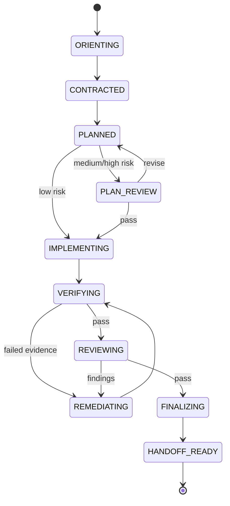

# Superworkflows v0.3 工作流重构设计

## 1. 摘要

v0.3 将 Superworkflows 从“一个路由器加六个同级阶段命令”重构为“四个公开命令加内部闭环能力”：

- `$loop-engineering`：从任务契约到独立审查、验证和 Handoff 的完整工程闭环；
- `$status`：只读检查 Run、证据、Finding、Handoff、Release 和下一步；
- `$release`：消费不可变 Handoff，评估或执行明确授权的提交、PR、版本和部署动作；
- `$knowledge-evolution`：从已完成 Run/Release 中形成受审查、待批准的知识或工作流改进提案。

删除 `$init`、`$run`、`$review` 和 `$learn`，不提供别名，不迁移旧 Run。Review 保留为 Loop Engineering 和自然语言只读审查请求使用的内部能力。CodeGraph 从前置依赖降为条件式结构检索加速器；没有 MCP、CLI 或索引时，模型使用原生 Explore、搜索、源码读取和 Git 工具继续工作。

该设计参考 MiMo-Code 的 [Compose Next](https://github.com/XiaomiMiMo/MiMo-Code/blob/main/packages/opencode/src/skill/builtin/.bundle/compose-next/SKILL.md) 和 [Compose 工作流](https://github.com/XiaomiMiMo/MiMo-Code/blob/main/packages/opencode/src/workflow/builtin/compose.js)：交互路径采用一个紧凑闭环并在 Finish/Handoff 停止；确定性无人值守路径才可以在独立授权下继续合并或发布。Superworkflows 保留机器人和具身智能所需的证据、回滚与硬件授权边界，不照搬 Compose 的通用软件假设。

## 2. 问题

v0.2.5 的能力总体完整，但用户界面和机器生命周期存在四类结构问题：

1. `$init` 把 CodeGraph 初始化和 `.ai` 持久状态创建绑定在一起。仓库没有 CodeGraph 时仍给人“必须先初始化”的印象，而模型原生工具已经能够完成探索。
2. `$run` 实际执行 `assets/loop-engineering/workflow.md` 的完整工程闭环，名称没有表达真实方法论。
3. `$review` 与 `$run` 内部的计划审查、代码审查和安全审查重复出现在主流程表面。
4. `$run` 同时包含集成、Release readiness 和 Learning；`$release` 又重复集成与就绪检查；`$learn` 则被机器状态视为完成前必经阶段，导致工程、发布和知识演进边界不清。

此外，当前 Windows 基线无法运行主要控制面：`loopctl.py` 和 `sync_agents.py` 无条件依赖 POSIX `fcntl`，子进程文本按系统 GBK 解码，符号链接测试假定具有 Windows 特权，插件版本测试仍断言 `0.2.0`。v0.3 必须同时修复这些质量问题，否则命令重命名不会产生可靠的跨平台插件。

## 3. 目标与非目标

### 3.1 目标

- 让普通用户只理解工程、状态、发布和知识演进四个稳定意图。
- 让精确 `$loop-engineering` 调用自动建立可恢复 Run，无需预初始化。
- 让内部 Review 成为风险自适应门禁，而非用户必须编排的同级阶段。
- 以一个不可变、可验证的 Handoff 明确分隔工程与发布。
- 让 Knowledge Evolution 可选、后置、提案驱动，禁止活动 Run 自修改。
- 在 CodeGraph 不存在或不可用时安全降级。
- 在 Windows、Linux 和 macOS 上提供一致的控制面与测试结果。
- 保留独立审查、证据新鲜度、回滚和外部/硬件动作授权等安全属性。

### 3.2 非目标

- 不兼容旧命令或 workflow-spec v1 Run。
- 不自动初始化 CodeGraph。
- 不把本地哈希链描述为密码学身份认证。
- 不让 Knowledge Evolution 自动修改生产 Skill、Agent、安全门禁或活动 Run。
- 不让 `$loop-engineering` 隐式授权 Push、PR、Tag、Publish、Deploy、HIL 或真机动作。
- 不引入通用个人记忆、递归委派、定时任务或无限自主循环。

## 4. 用户界面

| 命令 | 输入 | 默认行为 | 可产生的副作用 | 结果 |
|---|---|---|---|---|
| `$loop-engineering <task>` | 任务描述 | 新建持久 Run 并执行闭环 | 仓库源码、测试、本地分支/Worktree、Run 状态 | Final 或阶段性 Handoff |
| `$loop-engineering resume <run-id>` | 精确 Run ID | 校验 Lineage、仓库、工作区和事件后恢复 | 继续指定 Run | 更新检查点或 Handoff |
| `$status [run-id]` | 可选精确 Run ID | 未指定时列出候选；指定时深入检查 | 无 | 阶段、证据、Finding、阻塞和下一动作 |
| `$release <run-id> [action]` | Run/Handoff 与可选动作 | 未指定动作时仅做 Readiness Check | 仅执行明确授权动作 | Release 记录、URL、版本或阻塞原因 |
| `$knowledge-evolution [run-id…]` | 一个或多个完成 Run/Release | 提炼和审查候选改进 | 仅写 Proposal | Project knowledge、Policy 或 Workflow 提案 |

旧的 `$init/$run/$review/$learn` 返回 `UNSUPPORTED_COMMAND` 和对应新命令提示，不加载旧流程，不执行兼容逻辑。

`skills/superworkflows` 继续作为可隐式发现的内部安全路由器，但不出现在公开 Quick Start 命令表中。它只负责意图、持久性和权限分类：

- 复杂实现请求 → Session-only Loop Engineering，除非用户精确调用 `$loop-engineering`；
- 状态请求 → `$status` 的只读能力；
- Release 请求 → Readiness-only，直到精确 `$release` 和动作授权成立；
- 知识提炼请求 → Response-only，直到精确 `$knowledge-evolution`；
- 单独审查请求 → 加载 `assets/loop-engineering/review.md` 与只读 Reviewer Agent，不暴露 `$review` Skill 或命令。

## 5. Loop Engineering 生命周期



机器状态为：

`NEW`、`ORIENTING`、`CONTRACTED`、`PLANNED`、`PLAN_REVIEW`、`IMPLEMENTING`、`VERIFYING`、`REVIEWING`、`REMEDIATING`、`FINALIZING`、`HANDOFF_READY`、`CANCELLED`。

Run status 与阶段分离：`ACTIVE`、`PAUSED`、`BLOCKED`、`COMPLETE`、`CANCELLED`。`HANDOFF_READY + COMPLETE` 只表示工程 Handoff 完成，不表示代码已发布。

任何活动状态都可以因用户决定、资源或授权进入 `PAUSED`，因安全、仓库规则、证据或不可恢复环境问题进入 `BLOCKED`。暂停或阻塞写入阶段性 Checkpoint；恢复必须使用精确 Run ID。状态机删除 v1 的 `INTEGRATING`、`AWAITING_EXTERNAL_APPROVAL`、`DELIVERING` 和 `LEARNING`，这些职责分别进入 Release 或 Knowledge Evolution 生命周期。

## 6. 风险自适应 Review

| 风险等级 | 判定示例 | 必须执行的独立门禁 |
|---|---|---|
| Low | 局部、低影响、无安全接口变化 | 验证后的最终 Diff Review |
| Medium | 跨模块、接口、持久化、并发或回滚相关 | Plan Review + 最终 Diff Review |
| High | 控制、安全、执行器、实时、HIL、真机、模型发布 | Plan Review + Code Review + Safety/Environment Evidence Review |

所有等级必须经过需求契约、实现、实际验证、独立 Review、Finalize 和 Handoff。低风险可以合并文档或实现活动，但不能删除最终独立 Review。Reviewer 为只读角色，接收规范与验收条件、Base/Head SHA、Diff 坐标和精简验证摘要；不接收实现者的结论性叙述。Verify 完全结束后才启动 Review。Implementer 可以标记 Finding 为 `FIXED`，只有独立 Reviewer 可以在当前 Commit 与证据上标记 `VERIFIED`。

## 7. 持久化与文档

精确 `$loop-engineering` 是创建持久 Run 的授权边界。它在首次状态写入前自动 Bootstrap；不需要 `$init`。隐式路由保持 Session-only，不创建 `.ai/`。用户明确要求不持久化时，Loop 只在会话中运行并在回复里给出非持久 Handoff，且不得宣称可恢复。

```text
.ai/
├── project-policy.json
├── runs/<run-id>/
│   ├── run.json
│   ├── events.jsonl
│   ├── run.md
│   ├── evidence/
│   ├── checkpoints/<sequence>.json
│   └── handoff.json
├── releases/<release-id>/
│   ├── release.json
│   ├── events.jsonl
│   └── evidence/
└── knowledge/proposals/<proposal-id>.md
```

`.ai/project-policy.json` 是可选、用户维护的仓库命令与门禁覆盖层，不存在时不得阻塞 Loop。插件不自动生成它；每个 Run 从仓库事实发现测试、构建、回放和安全门禁并记录在 `run.json`。重复且稳定的发现可由 Knowledge Evolution 提出 Policy 更新。

v0.2.5 的十一个编号叙述文档合并为一个 `run.md`：

- `[S1] Problem and Contract`
- `[S2] Design and Safety Invariants`
- `[S3] Out of Scope`
- `Tasks`
- `Report`
- `Verification`
- `Review and Residual Risk`
- `Journey Log`（最多五条可迁移经验）

`run.json` 保存机器状态、任务、Finding、证据索引和当前 Handoff 指针；`events.jsonl` 保持追加式哈希链；`evidence/` 保存命令元数据、退出码、输出哈希和制品哈希。哈希链用于发现偶发或局部篡改，不是抵抗同一用户替换全部本地状态的签名系统。

## 8. Handoff 契约

暂停或阻塞写入递增的 `checkpoints/<sequence>.json`，记录已完成成果、证据、阻塞原因和准确恢复入口。只有 `FINALIZING` 成功后写入一次 `handoff.json`；写入后不可修改。

Final Handoff 必须包含：

- Schema、Run、仓库、分支、Worktree、Base/Source Head SHA、Reviewed Git Tree Digest 和 Workspace Digest；
- 需求契约、范围、验收条件、Out-of-scope 和安全不变量；
- 最终 Diff 摘要与每个任务的结果；
- 验证命令、环境、退出码、`PASS/FAIL/NOT_RUN` 与证据哈希；
- Reviewer 身份记录、Verdict、Finding 状态和剩余风险；
- 回滚目标、程序、触发条件、恢复时间估计和最高已授权环境证据；
- 未验证的 Replay/Simulation/HIL/Robot 门禁；
- 推荐 Release 动作及禁止自动执行的动作。

Handoff 计算规范化 SHA-256。Release 记录该哈希，并在任何动作前重新计算仓库、Reviewed Tree、Workspace 与证据新鲜度。任何文件内容、配置、制品或证据变化产生 `STALE_HANDOFF`；Release 不修改实现，而是要求新建或恢复 Loop，在重新 Verify/Review/Finalize 后生成新 Handoff。

`commit` 是唯一允许改变 Commit SHA 而不使 Handoff 失效的封装动作：它只能把 Handoff 已绑定的未提交工作树写成 Commit，不得编辑文件；提交后的 Git Tree 必须与 `reviewed_tree_digest` 完全一致。Release record 保存 `source_head_sha`、新 `release_commit_sha` 和相同 Tree digest。已有相同 Reviewed Tree 的干净 Commit 时，`commit` 为幂等 No-op。Push、PR 和 Tag 只能引用这个已验证的 Release Commit。

## 9. CodeGraph 能力降级

CodeGraph 由一个集中式 Capability Resolver 处理，Skill 不再重复硬编码前置步骤：

1. 先读 `AGENTS.md` 等仓库规则。
2. 仓库强制要求 CodeGraph 且无法得到健康索引时返回 `BLOCKED`。
3. 已有健康 `.codegraph/` 时优先 MCP；MCP 不存在但 CLI 可用时使用 CLI。
4. 没有索引、MCP 或 CLI 时使用模型原生 Explore、文件搜索、源码读取和 Git 工具。
5. 插件永不自动初始化缺失索引。用户可在普通工具任务中另行明确要求初始化，但这不是 Superworkflows 生命周期阶段。
6. 精确、可写 Loop 在已有索引上可以执行同步。同步失败时标记 `DEGRADED` 并改用当前 Source/Git；仓库强制 CodeGraph 时改为 `BLOCKED`。
7. Graph 只提供结构导航和影响范围线索。最终源码事实来自当前 Source/Git，行为事实来自实际执行的命令。

## 10. Release 生命周期

`$release` 不属于工程状态机。它创建独立 Release record，引用 Final Handoff 哈希：

`NEW → VALIDATING_HANDOFF → READY → AWAITING_AUTHORIZATION → EXECUTING → RECONCILING → RELEASED`

失败可进入 `BLOCKED`；用户可以 `CANCELLED`。仅调用 `$release <run-id>` 停在 Readiness Check，不产生仓库或外部副作用。

动作包括 `commit`、`push`、`pr`、`tag`、`publish`、`deploy-sim`、`run-hil`、`deploy-robot` 和 `run-real-robot`。每个可变动作必须明确绑定 Action、Target、Commit、Handoff digest、授权者和有效期。硬件动作在执行前再次请求即时确认。执行前记录幂等 Operation Intent；响应丢失时先 Reconcile 外部状态，禁止盲目重试 `PENDING` 或 `UNKNOWN` 操作。

## 11. Knowledge Evolution

`$knowledge-evolution` 只读取 `HANDOFF_READY` Run 和已结束 Release，不读取活动 Run 作为可推广结论。候选分三类：

1. Project Knowledge：稳定的架构事实、决策与约束；
2. Project Policy：可复用的命令、门禁、证据和回滚规则；
3. Workflow/Skill：重复的人工流程、Reviewer 模式、模板或 Agent 改进。

候选必须包含来源 Run/Handoff 哈希、观察次数、用户纠正来源、反例、隐私检查、预期收益、安全影响、离线评估、Canary、Rollback 和复审日期。多 Run 重复观察可以进入 Review；单 Run 候选标记 `PROVISIONAL`，但明确用户纠正可以作为一个高权重来源。Proposal 状态为 `PROVISIONAL`、`REVIEW_PENDING`、`REVISE`、`APPROVED`、`REJECTED`、`SUPERSEDED` 或 `APPLIED`。

Knowledge Evolution 不直接应用 Proposal。明确批准后创建新的 `$loop-engineering` Run 修改目标知识、Policy、Skill、Agent 或模板，并执行对应回归、Review 和 Handoff。原 Proposal 仅在该实施 Run 完成后标记 `APPLIED`。

## 12. 错误与收敛语义

| 结果 | 含义 | 行为 |
|---|---|---|
| `DEGRADED` | 可选能力不可用，但有安全替代路径 | 记录限制并继续 |
| `PAUSED` | 等待用户决定、资源或授权 | 写 Checkpoint，可精确恢复 |
| `BLOCKED` | 安全、规则、证据或环境前置条件不满足 | 停止受影响路径，列出解除条件 |
| `NON_CONVERGENT` | 修复/Review 循环重复或引入新 Critical | 写阶段性 Handoff，不强行通过 |
| `STALE_HANDOFF` | Handoff 与当前工程事实不一致 | Release 拒绝，返回 Loop |
| `COMPLETE` | Final Handoff 已生成 | 不暗示已发布 |

Run 对 Agent attempts、Review/fix cycles、状态跳转和证据命令时间设预算。达到预算不转化为成功。非收敛条件同时考虑次数和行为：同一区域重复 Finding、修复引入新 Critical、验证结果振荡或证据持续无法复现。状态变化、Finding、Evidence、授权和外部 Intent 都在工具结果边界后立刻 Checkpoint。

## 13. 内部执行优化

- 从最终计划生成无环 Task DAG；仅并行执行依赖已满足且写集不相交的任务。
- 并行写任务使用独立 Worktree；单任务默认留在当前受控工作区，避免无收益的隔离成本。
- 子 Agent 接收 Objective、Acceptance、允许文件、输入 SHA/Digest、所需证据、权限和停止条件，不接收整段父会话。
- 子 Agent 返回结构化 AgentResult；主 Agent 是唯一 Run ledger writer。
- Verify 输出压缩为每条命令的 `PASS/FAIL/PRE_EXISTING/NOT_RUN`、计数和证据引用；Reviewer 只在结果陈旧或出现具体反证时重跑重型命令。
- `run.md` 负责可读叙述，JSON/JSONL 负责控制面，Evidence 负责行为事实；同一事实不在多个 Markdown 模板中复制。
- Loop 在 Finalize 时检查验收覆盖、未关闭 Finding、证据新鲜度、残余风险和 Handoff 完整性，防止乐观提前结束。

## 14. 跨平台控制面

v0.3 支持 Windows、Linux 和 macOS：

- 新建标准库 `file_lock` 抽象：POSIX 使用 `fcntl.flock`，Windows 使用 `msvcrt.locking`，并通过同一 Context Manager 暴露阻塞/非阻塞锁语义；
- 所有文本子进程显式使用 UTF-8 和受控错误替换，测试 Fake CLI 也固定 UTF-8；
- 路径比较使用解析后的平台路径和大小写规则，不依赖字符串斜杠；
- Windows 无符号链接权限时跳过真实 Symlink 集成测试，同时用 Mock/路径验证单元测试覆盖拒绝逻辑；具有权限时继续运行真实测试；
- 测试临时目录使用可配置根并避免系统权限假设；
- 修正 Plugin Contract 的版本断言，使 Manifest、Compatibility 和 Workflow Spec 版本一致。

## 15. 测试与验收

### 15.1 Skill 与路由

- 公开 Skill 集合和 Manifest 只广告四个命令；内部 Router/Reviewer 不作为主流程提示。
- 新命令的显式、隐式、Session-only、Persistent 和外部授权路径具有回归语料。
- 旧命令返回 `UNSUPPORTED_COMMAND`，且不会创建状态或调用旧 Skill。
- 自然语言只读 Review 能加载内部 Reviewer，但不能写仓库或 Run ledger。

### 15.2 状态与证据

- workflow-spec v2 的状态、转移、Back-edge、暂停、阻塞、取消和终态封闭。
- 自动 Bootstrap、精确 Resume、事件链恢复、证据篡改和 Workspace drift。
- Low/Medium/High 风险门禁与 Reviewer 独立关闭 Finding。
- Verify failure、Review remediation、预算耗尽和 `NON_CONVERGENT` Checkpoint。
- `run.md` 单文档和结构化状态之间的引用完整性。

### 15.3 CodeGraph

- 健康 MCP、CLI fallback、Native Explore fallback、已有索引同步失败和仓库强制要求五条路径。
- 缺失索引永不触发自动初始化。
- Graph 结果不能单独关闭 Finding 或证明运行时行为。

### 15.4 Handoff 与 Release

- Final Handoff 一次写入、规范化哈希、源码/Commit/Evidence 变化导致失效。
- 未提交 Reviewed Tree 可以被无内容变化地封装为 Commit；提交后 Tree 不一致必须阻塞。
- 阶段性 Checkpoint 不能进入 Release。
- Readiness-only 无副作用；每个外部动作绑定 Action/Target/Commit/Handoff。
- Operation Intent 幂等、未知结果 Reconcile 和硬件即时确认。

### 15.5 Knowledge Evolution

- 只接受完成 Run/Release；单次观察为 Provisional。
- 来源、隐私、反例、Review、批准、Canary 和 Rollback 字段完整。
- Proposal 无法直接修改生产文件；应用必须引用新的 Loop Run。

### 15.6 平台与交付门禁

- Windows、Linux、macOS 运行同一核心测试带。
- 文件锁并发、UTF-8 输出、路径和有/无 Symlink 权限均覆盖。
- 全部单元测试、Plugin validator、JSON Schema、Markdown link、`git diff --check` 通过。
- 从当前 Windows 基线的 37 tests / 22 failures / 4 errors 收敛为零非预期失败；平台能力型 Skip 必须有明确理由。

## 16. 版本与删除范围

v0.3.0 是 Clean Break：

- 删除 `skills/init`、`skills/run`、`skills/review` 和 `skills/learn`；
- 新增 `skills/loop-engineering`、`skills/knowledge-evolution`、`assets/loop-engineering/review.md` 和内部 Reviewer Agent 资源；
- 保留并重写 `skills/status`、`skills/release` 和内部 `skills/superworkflows` Router；
- workflow-spec 升级为 v2，Run schema 升级为 v2；
- `loopctl.py` 不读取或迁移 v1 Run，遇到 v1 时给出归档和重新启动指引；
- 删除 11 个旧模板，新增单一 `run.md` 模板、Checkpoint schema 和 Handoff schema；
- 重写 Trigger Policy、Manifest、OpenAI metadata、README、README.zh-CN、Security、Changelog 和测试；
- 保留旧版本 Git 历史作为审计来源，不在 v0.3 运行时保留兼容代码。

## 17. 验收结论

当且仅当以下条件同时成立，v0.3 重构完成：

1. 用户主流程只需四个公开命令；
2. `$loop-engineering` 无需 Init 即可持久启动和精确恢复；
3. Review 在风险自适应闭环内独立执行；
4. Loop 以不可变 Handoff 结束，Release 与 Evolution 使用独立生命周期；
5. CodeGraph 缺失时原生探索可继续，仓库强制规则仍得到遵守；
6. Release 无法消费阶段性或陈旧 Handoff，外部/硬件权限不会被扩大；
7. Knowledge Evolution 只能提案，批准的应用经过新的工程闭环；
8. Windows、Linux、macOS 核心测试和 Plugin validation 全部通过。
